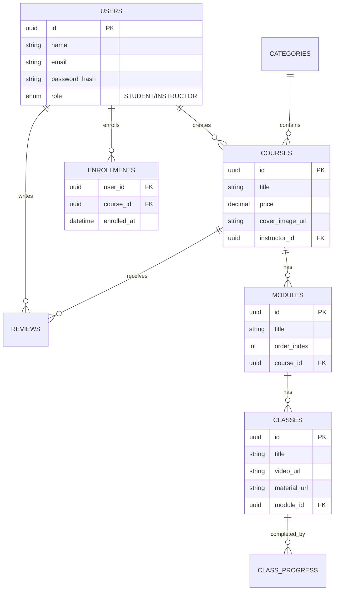

# 🚀 Desafio 2 - Backend (API de Cursos)


Uma API RESTful robusta e segura para gerenciamento de uma plataforma de cursos online, desenvolvida com **Node.js**, **Express** e **TypeScript**.

O projeto foca em segurança, escalabilidade e manutenibilidade, implementando padrões de arquitetura em camadas e diversas proteções contra vulnerabilidades web comuns.

---

## 🛠️ Tecnologias Utilizadas

### Core

- **Node.js**: Runtime JavaScript.
- **Express**: Framework web minimalista e flexível.
- **TypeScript**: Superset JS com tipagem estática para robustez.
- **SQLite (better-sqlite3)**: Banco de dados relacional leve e servidor-less.

### Segurança

- **Helmet**: Proteção de headers HTTP.
- **Cors**: Controle de acesso entre origens (Cross-Origin).
- **Rate Limit**: Proteção contra ataques de Força Bruta e DoS.
- **Bcrypt**: Hash seguro de senhas.
- **JWT**: Autenticação stateless via tokens.
- **File-Type**: Validação rigorosa de arquivos via Magic Numbers (Assinatura Binária).

### Utilitários

- **Multer**: Manipulação de uploads `multipart/form-data`.
- **Dotenv**: Gerenciamento de variáveis de ambiente.

---

## 🏗️ Arquitetura e Lógica

O projeto segue o padrão **MVC (Model-View-Controller)** adaptado para APIs (sem View), com uma separação clara de responsabilidades em camadas:

1.  **Rotas (`src/routes`)**:
    - Definem os endpoints da API.
    - Aplicam middlewares de validação, autenticação e autorização.
    - Delegam a requisição para o Controller apropriado.

2.  **Middlewares (`src/middlewares`)**:
    - **AuthMiddleware**: Verifica e decodifica o Token JWT.
    - **RoleMiddleware**: Controle de Acesso Baseado em Função (RBAC) - Aluno vs Instrutor.
    - **ValidationMiddleware**: Valida a entrada de dados (Schema Validation).
    - **RateLimit**: Protege rotas sensíveis (Login) e globais.

3.  **Controllers (`src/controllers`)**:
    - Recebem a requisição (`req`) e enviam a resposta (`res`).
    - Orquestram a chamada aos Serviços.
    - Não contém regras de negócio complexas.

4.  **Services (`src/services`)**:
    - Contém toda a regra de negócio (ex: "Aluno já comprou este curso?", "Instrutor é dono deste curso?").
    - Chamam os Repositórios para acesso a dados.
    - Lançam exceções (`ApplicationError`) em caso de regras violadas.

5.  **Repositories (`src/repositories`)**:
    - Camada de acesso direto ao banco de dados (SQLite).
    - Executam queries SQL seguras (Prepared Statements) para prevenir SQL Injection.

6.  **Utils (`src/utils`)**:
    - **Validator**: Validação manual de tipos e regras sem dependências externas pesadas.
    - **StorageService**: Gerencia salvamento seguro de arquivos no sistema local.

---

## 💾 Modelo de Entidades (Banco de Dados)

O sistema utiliza um banco relacional com as seguintes tabelas principais:



### Explicação das Entidades

- **Users**: Podem ser Alunos ou Instrutores.
- **Categorias**: Classificação macro dos cursos.
- **Cursos**: Entidade principal vendável, criada por Instrutores.
- **Módulos**: Divisão lógica do conteúdo do curso.
- **Aulas**: Conteúdo final (vídeo e material complementar).
- **Matrículas (Enrollments)**: Registro de compra/entrada de um aluno em um curso.
- **Progresso**: Rastreia quais aulas o aluno concluiu.
- **Avaliações**: Feedback de alunos sobre cursos (Nota 1-5 e comentário).

---

## 🛡️ Destaques de Segurança

1.  **Fail-Fast Startup**: O servidor se recusa a iniciar se variáveis críticas (`.env`) estiverem faltando.
2.  **Validação de Uploads**:
    - Rejeita arquivos executáveis (`.exe`, `.sh`) mesmo se renomeados.
    - Verifica o conteúdo binário real do arquivo.
    - Armazena arquivos com nomes aleatórios (UUID) para evitar sobrescrita e previsibilidade.
3.  **Acesso a Arquivos**:
    - Arquivos de aula **NÃO** são públicos.
    - O download só é permitido se o usuário for o dono do curso ou um aluno matriculado, verificado em tempo real.
4.  **Sanitização**:
    - Queries SQL parametrizadas.
    - Entradas de texto validadas rigorosamente.

---

## 🚀 Como Rodar o Projeto

### Pré-requisitos

- Node.js (v22+)
- Npm ou Yarn

### Instalação

1. Clone o repositório.
2. Instale as dependências:
   ```bash
   npm install
   ```
3. Configure o `.env` na raiz (use `.env.example` como base).

### Execução

#### Desenvolvimento

- **Modo Desenvolvimento** (com hot-reload):
  ```bash
  npm run start:dev
  ```
  O servidor será iniciado com `ts-node-dev` e reiniciará automaticamente quando houver alterações no código.

#### Produção

- **Build** (compilar TypeScript para JavaScript):

  ```bash
  npm run build
  ```

  Os arquivos compilados serão gerados na pasta `dist/`.

- **Iniciar em Produção**:
  ```bash
  npm run start
  ```
  Executa o servidor a partir dos arquivos compilados em `dist/`.

#### Testes

- **Executar Todos os Testes**:

  ```bash
  npm test
  ```

- **Testes Unitários** (testes isolados de services, utils, etc):

  ```bash
  npm run test:unit
  ```

- **Testes de Integração** (testes de múltiplos componentes):

  ```bash
  npm run test:integration
  ```

- **Testes E2E** (testes de fluxo completo da API):

  ```bash
  npm run test:e2e
  ```

- **Modo Watch** (reroda testes ao salvar arquivos):

  ```bash
  npm run test:watch
  ```

- **Relatório de Cobertura**:

  ```bash
  npm run test:coverage
  ```

  O relatório HTML será gerado em `coverage/lcov-report/index.html`

### Estrutura de Testes

O projeto utiliza **Jest** com a seguinte organização:

- **`tests/unit/`**: Testes isolados de componentes individuais (services, utils)
  - Mocks de todas as dependências externas
  - Execução rápida
  - Exemplo: `authService.test.ts`

- **`tests/integration/`**: Testes de múltiplos componentes trabalhando juntos
  - Pode usar banco de dados de teste
  - Exemplo: service + repository + database

- **`tests/e2e/`**: Testes de fluxos completos da API
  - Usa supertest para requisições HTTP
  - Testa todo o ciclo request/response
  - Exemplo: fluxo completo de login

- **`tests/setup/`**: Configuração global dos testes
  - `testSetup.ts`: variáveis de ambiente e configurações
- **`tests/mocks/`**: Mocks reutilizáveis
  - `mockRepositories.ts`: implementações mockadas de repositories
  - Compartilhados entre vários testes

#### Padrão AAA (Arrange-Act-Assert)

Todos os testes seguem o padrão AAA para clareza:

```typescript
it('should return user when credentials are valid', async () => {
  // Arrange - Preparar dados e mocks
  mockRepository.findByEmail.mockReturnValue(mockUser);

  // Act - Executar a função sendo testada
  const result = await authService.login(credentials);

  // Assert - Verificar o resultado
  expect(result.user).toBeDefined();
  expect(result.token).toBeTruthy();
});
```

---

## 📚 Documentação da API (Swagger)

A API possui documentação interativa completa via **Swagger UI**, acessível em:

**http://localhost:3333/docs**

### Recursos Documentados

- ✅ **Auth**: Login, Logout, Registro (Estudante/Instrutor)
- ✅ **Users**: Perfil do usuário
- ✅ **Categories**: CRUD de categorias
- ✅ **Courses**: CRUD de cursos, upload de capa, listagem
- ✅ **Modules**: Gerenciamento de módulos
- ✅ **Classes**: Gerenciamento de aulas, upload de materiais
- ✅ **Reviews**: Sistema de avaliações
- ✅ **Cart**: Carrinho de compras e checkout
- ✅ **Student**: Dashboard do estudante, progresso
- ✅ **Certificates**: Geração e validação de certificados

A documentação Swagger permite:

- 📖 Visualizar todos os endpoints disponíveis
- 🔍 Ver schemas de request/response
- 🧪 Testar endpoints diretamente pela interface
- 🔐 Autenticar usando cookies httpOnly

---

## 📄 Documentação Adicional

- **[Documentação da API (Endpoints)](./API_DOCUMENTATION.md)**: Detalhes completos de todas as rotas (Auth, Cursos, Módulos, Uploads, etc).
- **[Relatório de Testes](./RELATORIO_TESTES_FINAL.md)**: Log da última execução da suíte de testes automatizados.
- **[Auditoria de Segurança](./security_audit.md)**: Relatório detalhado das melhorias de segurança implementadas.
